# **ArrayList**

### **ArrayList, static olmayan ve yapılan işlemelere göre boyutu artan veya azalan bir yapıdır.**

 

> ## **Kullanılan fonksiyonlar**

### **`add`**   
### **`insert`**  
### **`print`**   
### **`indexOf`**   
### **`get`**  
### **`isEmpty`**   
### **`remove`**  
### **`pop`**  
### **`copy`**   
### **`contains`**   
### **`counter`**   
### **`clear`**   
### **`front`**   
### **`back`**   
### **`end`**   
### **`begin`**   
### **`growth`**   
### **`shrink`**   
### **`reset`**  

  

> # **Kullanım örnekleri**

 

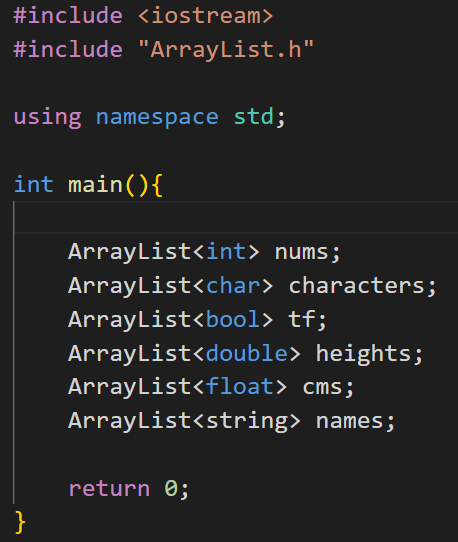

 

> ## **`add` fonksiyonu**
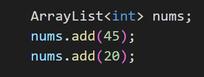

 

> ## **`insert` fonksiyonu**
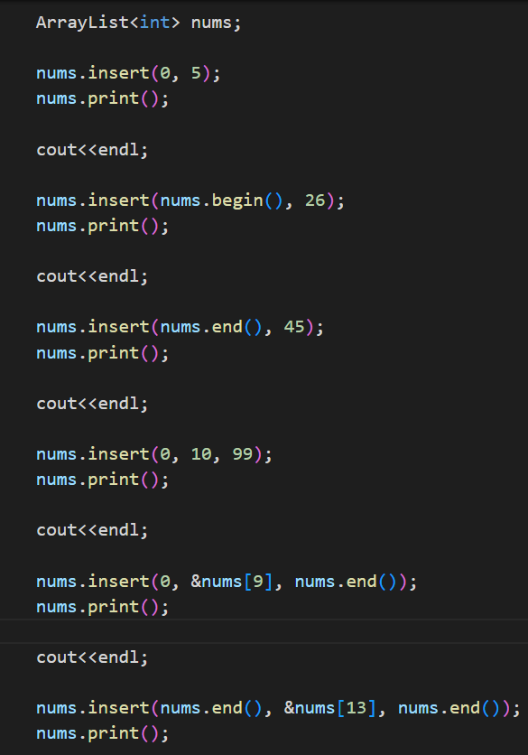
 
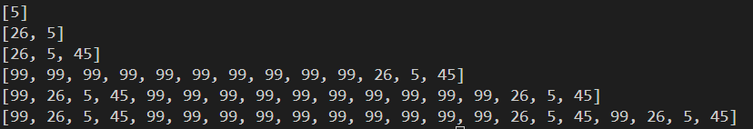

 

> ## **`indexOf` fonksiyonu**
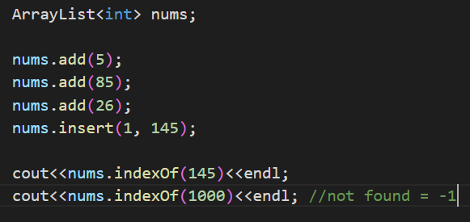

 

> ## **`get` fonksiyonu**
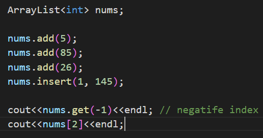

 

 

> ## **`isEmpty` fonksiyonu**
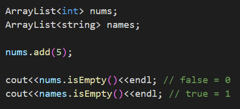

 

 

> ## **`remove` fonksiyonu**
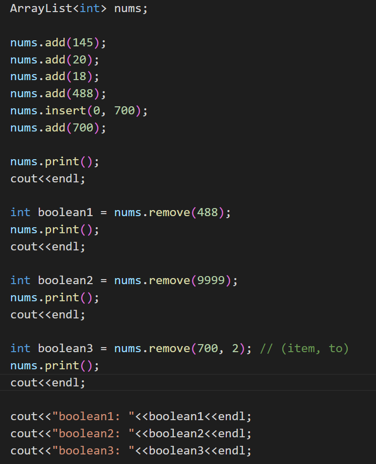
 
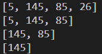

 

 

> ## **`pop` fonksiyonu**
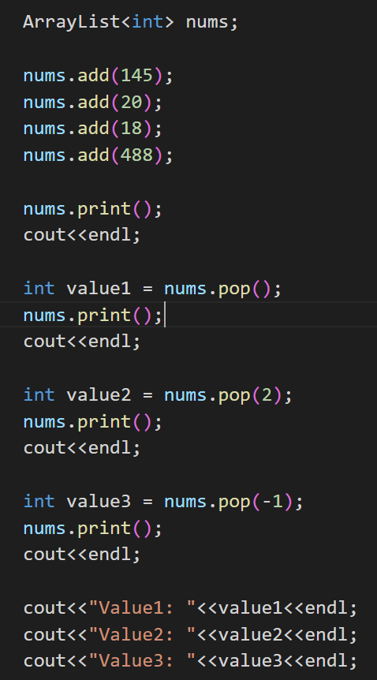
 
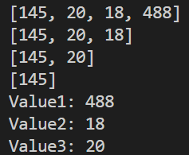

 

 

> ## **`copy` fonksiyonu**
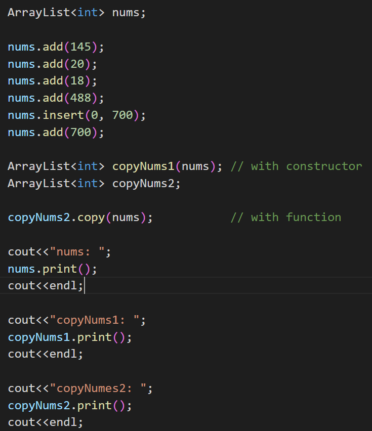
 
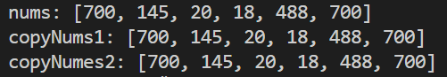

 

 

> ## **`clear` fonksiyonu**
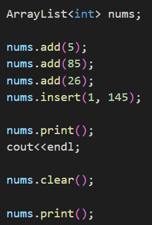
 
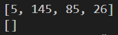

 

  

## Güncellemeler

## v1.1
📌 İki yeni `insert` methodu eklendi.  *Test aşamasındalar*. 
 
📌 `remove` fonksiyonu negative index ile çalışır hale geldi. 
 

## v1.2
📌 v1.1 sürümünde eklenen `insert` methodlarının hataları düzeltildi. 
 

## v1.3
📌 v1.1 sürümünde eklenen `insert` methodlari daha kararlı hale getirildi. 
 

## v1.4 
📌 `pop`, `copy`, `contains` ve `counter` fonksiyonlari eklendi.
 
📌 `remove` ile `pop`  fonksiyonlari gorevlerini degiştiler.
 